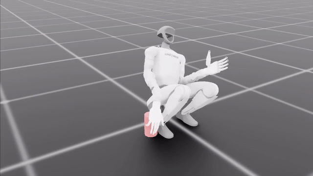
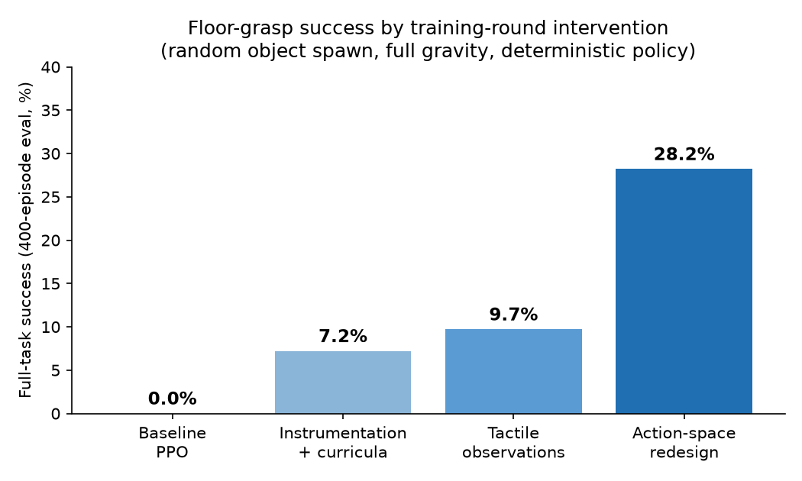
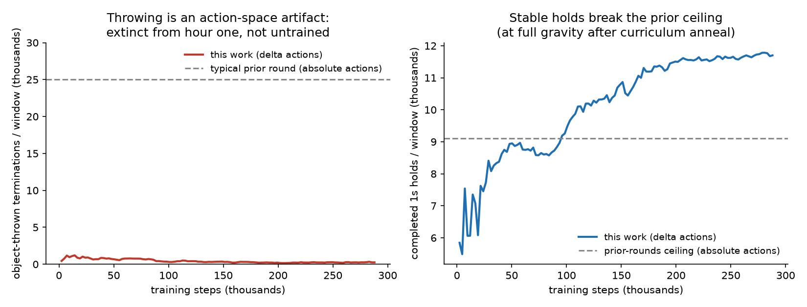
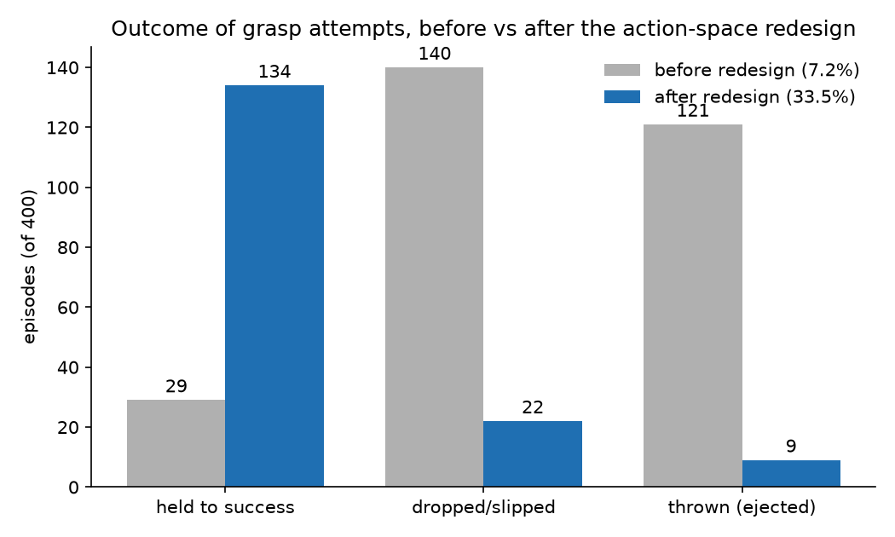
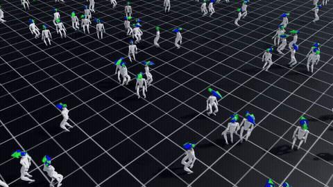
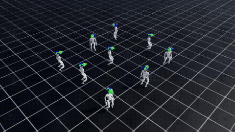
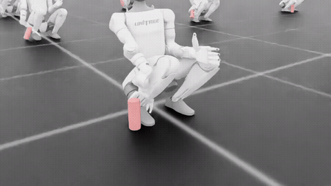
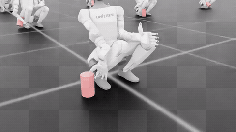

# groundwork

This project trains a low-cost humanoid robot (Unitree G1 with Inspire five-finger hands) to grasp objects from the floor. Training uses reinforcement learning in simulation. Training does not use teleoperation. Training does not use demonstration trajectories.

A grasp counts as a success only if the physics engine verifies the finger contacts. The success check does not use object proximity. The simulation does not weld the object to the hand. One rented GPU at a time trains all policies. The total rental cost is less than 250 USD.

The video shows one continuous episode. The user selects the object position. The robot squats, forms a five-finger grasp, lifts the object to 0.40 m, and holds it for 3 seconds. This satisfies the full strict protocol. Note: the shown position is in the competent region of the policy. Success changes with position. The success rate over random positions is 28.2%. See [media/06_strict_pickup.mp4](media/06_strict_pickup.mp4) for the multi-episode video. The tool [pod/demo_pickup.py](pod/demo_pickup.py) lets you set the object position, size, and mass. The tool then reports a scored episode and records a video.

**Headline result: 28.2% success under a strict, pre-specified protocol.**

The protocol requirements are:
- The object spawns at a random position and a random orientation.
- The policy is deterministic at evaluation time.
- Success requires a lift to 0.40 m with a hold for 3 continuous seconds.
- The hold must show contact on 3 or more finger links plus thumb opposition, verified by the physics engine.
- Each evaluation runs 400 episodes and publishes a failure taxonomy.

Protocol: [docs/EVAL_PROTOCOL.md](docs/EVAL_PROTOCOL.md). Scoring code: [pod/demo_grasp.py](pod/demo_grasp.py). We do not distribute the trained weights or the training stack.

## Results

| Intervention round | Strict success | Primary change |
|---|---|---|
| Baseline PPO | 0% | — |
| Instrumentation and curriculum repairs | ~7% (plateau over 4 rounds) | all intermediate metrics improved; success did not |
| Tactile observations | ~9% | touch-to-grip conversion increased from 54% to 64% |
| **Action-space restructure** | **28.2%** | **lift-to-hold conversion increased from 17% to 97%** |

All rows use the same protocol. Direct comparison between rows is valid.

## Comparison with related systems

The table below places this project among related systems. The systems solve different tasks under different protocols. **Do not compare the result numbers directly.** The table shows the position of each system on platform cost, data requirements, and compute.

| System | Platform | Hand cost | Task | Human data | Training compute | Reported result |
|---|---|---|---|---|---|---|
| [Dactyl (OpenAI, 2018)](https://openai.com/index/learning-dexterity/) | Shadow Hand, fixed mount | ~100,000 USD | in-hand cube reorientation at bench height | none | ~400 CPU servers + 32 V100 GPUs | real-robot reorientation |
| [DexPBT (NVIDIA, 2023)](https://arxiv.org/pdf/2210.13702) | Allegro Hand on arm | ~15,000 USD | tabletop grasp and reorient | none | 8 datacenter GPUs | high success, simulation |
| [Robust Dexterous Grasping (2025)](https://arxiv.org/abs/2504.05287) | arm-mounted hand | — | tabletop grasping | none | — | 97% simulation, 94.6% real |
| [CLONE (2025)](https://arxiv.org/abs/2506.08931) | Unitree G1, whole body | — | ground pickup | teleoperation | — | real-robot demonstrations |
| [HumanPlus (2024)](https://github.com/YanjieZe/awesome-humanoid-robot-learning) / [ResMimic (2025)](https://github.com/YanjieZe/awesome-humanoid-robot-learning) | full humanoid, whole body | — | loco-manipulation | human motion data | — | real-robot skills |
| **groundwork (this project)** | G1 + Inspire, whole-body kneel | ~8,000 USD | **floor-level five-finger grasp** | **none** | **1 rented GPU, <250 USD** | 28.2% strict, simulation |

Three observations follow from the table:

1. The classic dexterous-RL results use arm-mounted hands at bench height. A fixed industrial mount solves the reach and support problem before learning starts. In this project, the robot must reach the floor from its own squat. The reach and balance problem is part of the task.
2. Humanoids that take objects from the ground today use teleoperation or human motion data. This project discovers the grasp strategy from physics alone. We tested a demonstration pipeline. It produced 1 usable demonstration per 10,000 attempts. We removed it. Disclosure: a mined bank of physics-verified pre-grasp states (not trajectories) seeded a fraction of the training resets in the middle rounds. The final run that produced 28.2% trained from a random initialization.
3. The compute budget here is smaller than the related systems by two or more orders of magnitude.

What the related systems do better: they show real-robot results at high success rates. All results on this page are simulation results. The physics settings are deliberately strict (see the engineering notes). The Inspire hand has physical fingertip force sensors. The tactile observations in this project therefore correspond to real hardware signals.

If you know prior work that covers this task combination, open an issue. We will cite it.

## The finding that removed the plateau

Four training rounds of reward engineering each improved a target failure mode. End-to-end success stayed between 7% and 10% in all four rounds. Per-episode instrumentation then isolated one invariant quantity: the median continuous hold among "successful lifts" was 0 frames. The median object speed at grip loss was 2.8 m/s. The policy did not drop objects. The policy threw them.

The root cause is the action space. The policy sent absolute joint-position targets at 50 Hz. PPO exploration noise moved the finger targets by a large fraction of their full travel at every control step. The noise destroyed every grasp during training. The value function then learned a correct fact: holds never persist. Grab-and-release became the optimal policy. **A reward function cannot reinforce a behavior that the exploration process prevents.**

We verified this mechanism from three directions before we changed the action space:
1. Scripted grasps with frozen targets hold without limit under identical physics.
2. The success plateau did not respond to six interventions on reward, friction, and mass.
3. A rate limit on a trained policy removed the throwing immediately, and also removed the policy's competence.

The repaired action space makes the zero action a fixed point under noise. A hold becomes the easiest behavior to express. One training run later: lift-to-hold conversion increased from 17% to 97%. Median hold time increased from 0 frames to more than 11 seconds. Median grip-loss speed decreased from 2.8 m/s to 0.00 m/s. Throws decreased from 121 to 9 per 400 episodes.

Left: object-throw terminations are near zero from the first training hour. The throwing was an artifact of the action space. It was not a habit that training had to remove. Right: stable holds increase through the ceiling that survived every reward intervention, at full gravity.

## Proof of progression

We validated the contact instrumentation against scripted ground truth before we trusted any learned result. The clip below shows a mined, physics-verified pre-grasp that a script executes. The label marks it as scripted:

Round-1 pipeline stages on the stock handless G1 (before the project unified all training on the hand-equipped robot):

First full-task floor pickups (5% era, random spawns):

Mid-progression grasp policy (before the action-space repair, ~7%). Approach and contact operate. Holds fail. This is the plateau that the action-space analysis explains:

## Engineering notes

- **Silent-failure detection.** The round-1 null result came from a sensor configuration error. A PhysX contact sensor returns an empty force matrix when one sensor prim matches more than one body per environment. The error is silent. Every contact reward and the success check read zero while training ran. We now validate every instrument against scripted ground truth before we trust a result.
- **Physics status, stated per stage.** The shipped robot asset has self-collision off, gravity off on the robot links, and a fixed base. Each setting inflates results silently. Current status: self-collision is on in all stages. The locomotion stage runs a free base with gravity on every link. This required USD surgery: we moved the articulation root to the pelvis and removed the finger mimic-joint couplings. **The grasp-stage numbers on this page use a pelvis-fixed kneeling robot with the asset default for link gravity.** The free-base grasp fine-tune is the current milestone. No number moves to the headline before it passes there. Object physics and world physics are unmodified in all stages.
- **Funnel analysis.** Every evaluation bins each episode by the deepest stage it reached: never-near, touched, gripped, lifted, held. Each bin has a conversion rate. We select interventions against the binding constraint.
- **Curricula in physics, not in rewards.** The two hardest skills (grasp formation, deep-kneel descent) both trained through an annealed physical difficulty on a fixed schedule. Evaluation always runs at full difficulty.
- **Hold-duration caveat.** Rigid-body simulation flatters hold stability. The 11-second holds will not transfer at that duration. The Inspire hand's physical fingertip sensors are the planned bridge for the transfer gap.

## Status

- Complete: isolated floor grasp at 28.2% strict and 35.5% standard (pelvis-fixed kneel, one object geometry at the easy end of the protocol range). Velocity-tracking walking on the hand-equipped free-base robot.
- In progress: height-commanded locomotion (stand to deep kneel on command). Two training runs collapsed to a single-height policy. Behavioral evaluation caught both. The third run adds a spawn-command coupling curriculum and currently tracks commands with less than 10 cm mean error in training.
- Next: free-base grasp fine-tune, object size and mass randomization over the full protocol ranges, and full composition: one continuous episode of walk, kneel, grasp, lift, and rise. Judged episodes contain no scripted motion.

Stack: NVIDIA Isaac Lab 2.3 / PhysX 5, RSL-RL PPO, 2048–4096 parallel environments, one rented GPU.
