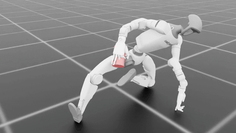
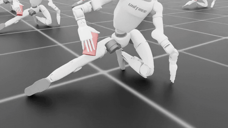
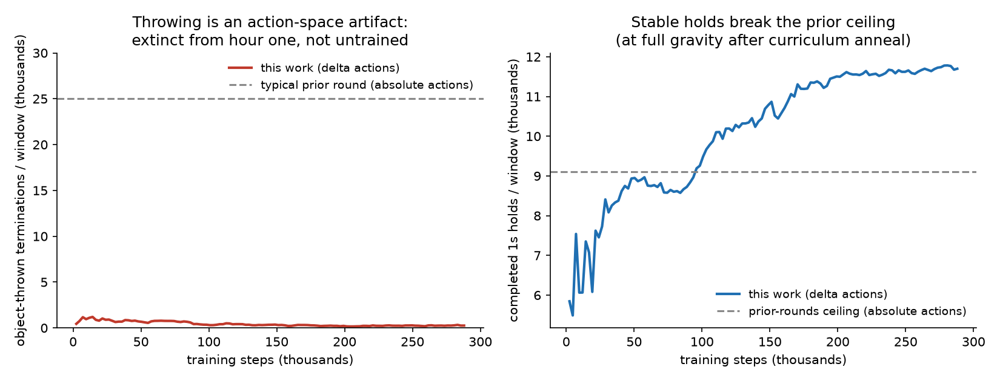

# groundwork

A Unitree G1 with Inspire five-finger hands learns to pick objects off the floor. RL in simulation — no demonstrations, no teleoperation, no motion capture. One rented GPU, ~$400 total.

**76.3% legal floor grasp from near starts** (229/300, reproduced in two environments). **0% on the full protocol**, because the walk leg was never chained in. The project did not finish.

Every headline number this produced before it built cheat detectors was wrong. That turned out to be the interesting part.

---

## The metric said 91.1% strict success



Posture telemetry read "upright." Hand planted flat on the floor as a tripod, torso folded ~70°, object pinned against its own thigh.

Every term in the posture gate was computed on the root link — up-vector, pelvis height, and a min-z check over a body set that excluded the hand chain. Torso pitch was never measured, so the fold was invisible. Hand links were excluded from the floor check, so the tripod was invisible. **Telemetry built from a gate's own terms cannot detect an exploit of that gate.**

| generation | metric said | footage showed | detector built |
|---|---|---|---|
| crab sprawl | 87–91% strict | tripod hand, folded torso, object on thigh | torso up-vector + hand-floor contact ([`probe_waistfold.py`](pod/g1_grasp/probe_waistfold.py)) |
| thigh pin | 50% legal | upright, hands free — object pressed to thigh | object-to-leg-link distance (`STRICT_OBJLEG`) |
| hand carry | 76% legal | genuine finger-wrapped carry | — |

Each defect strictly narrower than the last. Detectors were certified both ways before use: flag known-bad footage ≥95%, pass known-good states ≤5%. `probe_waistfold.py` caught 60/60 sprawls with 1 false positive in 654.

## What it actually does



Crouches to a cylinder (r=45 mm, h=15 cm, 0.5 kg), closes five fingers in a friction grasp, lifts to 0.40 m, holds 3+ s.

| environment | strict | legal | share |
|---|---|---|---|
| official eval | 237/300 | 229 | **76.3%** |
| stricter (extra gate terms) | 233/300 | 226 | 75.3% |

Caveats that travel with the number: near starts only; it holds in the deep lunge above and never stands; one checkpoint from a lane that never converged, whose siblings 200 iterations apart span **6%–88%**.

An earlier free-standing result of 35.5% (142/400) at random object positions is **withdrawn** — it was measured before the detectors above existed, in the deep-lean posture family they were built to catch, with the protocol's above-knee ground-contact clause unenforced by any harness.

## Why it stopped

[`probe_descent_authority.py`](pod/g1_grasp/probe_descent_authority.py) drives the action integrator along the reference by exact inversion — no policy, the ceiling of what any controller could achieve:

```
DESCENT  frames   0-150 : saturation 0.123   pelvis achieved 0.434   ref 0.560
RISE     frames 150-250 : saturation 0.122   pelvis achieved 0.233   ref 0.568
```

Pelvis 0.233 m is on the floor. The reference was a sequence of statically-valid IK poses, never checked against gravity or contact — **dynamically impossible**. Saturation at 12% means the rate limit wasn't binding; the trajectory simply cannot be executed.

Five interventions in one day — rise income, full-body tracking, base-only tracking, a raised gate, a backward curriculum — were all aimed at a motion the robot cannot perform. The probe runs in minutes and costs nothing. It was written after the money was gone.

Corollary: the lunge may never have been a defect. A splayed straight-legged stance carries load through geometry rather than torque. The policy likely found the demonstrated motion unusable and invented what works.

## Four more defects

**The action space, not the reward.** At 7% success the median continuous hold was 0 frames and median object speed at grip loss was 2.8 m/s — the policy *threw* objects. Absolute joint targets at 50 Hz meant PPO exploration noise moved fingers a large fraction of full travel each step, so no grasp survived training. Delta actions make the zero action a fixed point under noise: lift→hold 17% → 97%, holds 0 → 11 s, throws 121 → 9 per 400.



**Reset-boundary reads** — six instruments. Episode resets happen *inside* `step()`: state buffers show the fresh reset, sensor buffers and dones lag. A harvester captured 435 "grasp states" that were all spawn poses with no grasp — root height identical to 6 decimals, zero velocities. Three training runs died on that bank. Identical values across a harvested dataset are the fingerprint of capturing the reset writer.

**A normalizer that was never instantiated.** `isaaclab_rl` supplies `actor_obs_normalization: {}`; rsl_rl's deprecation shim fills the new key only when the old is `None`. `{}` is not `None`, and `{}` is falsy — observation normalization silently became `nn.Identity`, and 205 raw mixed-scale dims hit the first layer for an entire epoch. Three sibling mechanisms were live-but-inert the same night, including a reward paying zero on 95.8% of observed frames.

**Value clipping and entropy.** `use_clipped_value_loss=True` with no value normalization over a 17-term critic at 30:1 scale imbalance. Removing the clip alone then exploded action noise 0.50 → 0.92 — `entropy_coef > 0` on a state-independent log-std is a permanent upward gradient. The two fixes are a documented pair; shipping one exposed the other.

Full writeup: **[docs/POSTMORTEM_failure_catalogue.md](docs/POSTMORTEM_failure_catalogue.md)**.

## Protocol

[`docs/EVAL_PROTOCOL.md`](docs/EVAL_PROTOCOL.md), fixed before the runs. Six simultaneous conditions; hand-links-only contact verified from the PhysX contact report, not joint angles. Asserted every step: no fixed/D6 joints between hand and object, no inflated fingertip colliders, torques clamped to spec, no non-physical state writes after t=0.

Contact sensing was validated against scripted ground truth first — a PhysX sensor silently returns an empty force matrix when one prim matches multiple bodies, so every contact reward read zero while training ran anyway:


The vendor asset ships with self-collision off, gravity disabled on links, and the base bolted in space. Every number here runs with all three corrected.

## Layout

```
pod/g1_grasp/grasp_env.py    training environment, 2.2k lines
pod/g1_grasp/agents.py       PPO config
pod/g1_grasp/probe_*.py      ~30 probes, one falsifiable question each
pod/g1_loco/                 locomotion + kneel experts, handoff probes
tools/make_ref_traj.py       trajectory optimizer (the one that produced the bad reference)
tools/wbik.py, statics.py    35-DoF whole-body IK + friction-cone contact QP, CPU
tools/cert_*.py              reward-term activation certificates
src/grasp_synth/             local MuJoCo grasp lab, no GPU
banked/                      the two checkpoints the 76.3% was measured on
docs/                        postmortem, protocol
media/                       footage, successes and failures both
```

## Run

```bash
uv venv --python 3.11 .venv && uv pip install mujoco numpy pytest pillow imageio

# hand/robot models — sparse clone, ~85 MB instead of the full Menagerie
git clone --filter=blob:none --sparse https://github.com/google-deepmind/mujoco_menagerie assets/menagerie
git -C assets/menagerie sparse-checkout set shadow_hand unitree_g1 sharpa_wave

.venv/bin/python -m pytest tests/ -q          # local grasp lab, no GPU
```

GPU training targets Isaac Lab 2.3 / PhysX 5, RSL-RL PPO, 2048–4096 parallel envs on one rented GPU — [`pod/setup_pod.sh`](pod/setup_pod.sh).

**Reproduce the 76.3%.** The checkpoint the number was measured on ships in [`banked/`](banked/):

```bash
GRASP_NO_VIDEO=1 python pod/demo_grasp.py \
  --ckpt banked/GRASP_ARTIFACT_laneYb_25200.pt --episodes 300
```

[`demo_grasp.py`](pod/demo_grasp.py) computes STRICT and STRICT_LEGAL inline and prints both — the letter-strict count and the count with neither the waist-fold nor the hand-plant flag raised. Quote both, always; the gap between them is the whole lesson above.

`banked/GRASP_ARTIFACT_laneYb_25799.pt` is the sibling checkpoint 599 iterations later, shipped deliberately: run it and watch the number move. That spread is the non-stationarity, not noise — a frozen checkpoint scored three times returns 6/9/4 per 100, so the evaluation is reproducible and the policy is what is moving.

Earlier stages: [walking](media/01_walking.gif) · [walk-crouch-stand](media/02_walk_crouch_stand.gif) · [first pickups, 5%](media/04_first_floor_pickups_5pct.gif) · [pre-fix plateau, 7%](media/05_grasp_progress_7pct.gif) · [kneel-era](media/07_kneel_era_grasp.gif) · [descent + tipover](media/08_unified_descent_tipover.gif)

---

*Every number came from an instrument in this repo. Every claim has footage, including the failures.*
