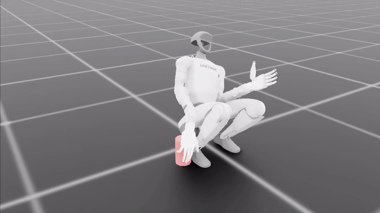
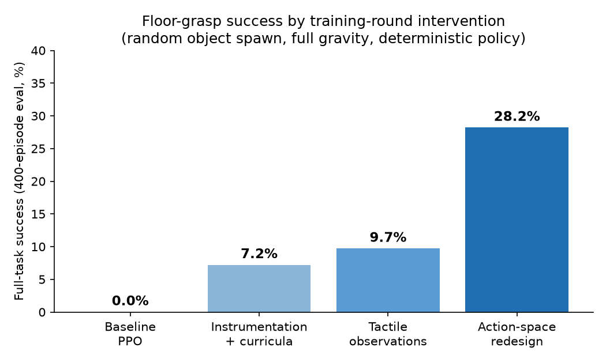
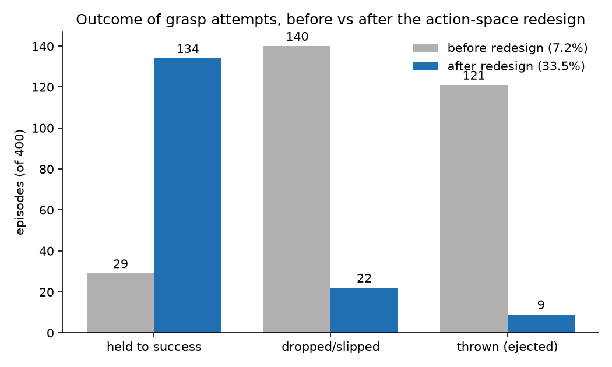
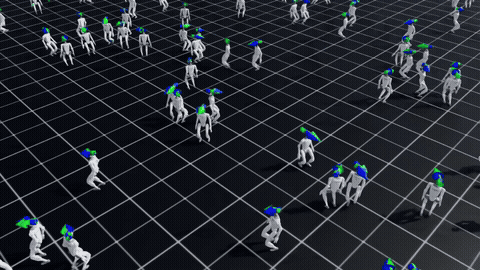
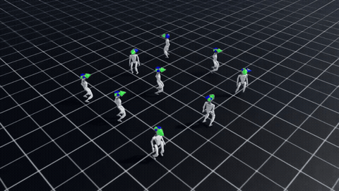
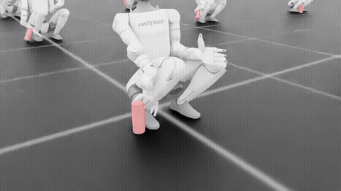
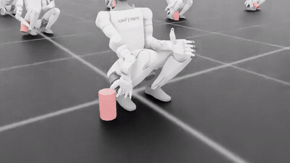

# groundwork

A Unitree G1 with Inspire five-finger hands learns to pick objects off the floor. RL in simulation. No demonstrations, no teleoperation, no motion capture. One rented GPU, under $250.

**35.5% success (142/400), strict protocol, robot balancing on its own legs.**

Success = lift to 0.40 m, hold 3 continuous seconds, with ≥3 finger links plus thumb in engine-verified contact. Random object position and orientation, deterministic policy, 400 episodes, failure taxonomy published. Protocol was fixed before the runs: [docs/EVAL_PROTOCOL.md](docs/EVAL_PROTOCOL.md), scoring in [pod/demo_grasp.py](pod/demo_grasp.py). Weights and training stack are not distributed.

One uncut episode at a user-chosen position (earlier pelvis-fixed policy; success varies with placement — the random-position rate for that policy is 28.2%). More episodes: [media/06_strict_pickup.mp4](media/06_strict_pickup.mp4). Choose positions yourself: [pod/demo_pickup.py](pod/demo_pickup.py).

## Numbers

| Round | Strict success | Change |
|---|---|---|
| Baseline PPO | 0% | — |
| Instrumentation + curriculum repairs | ~7% | intermediate metrics up, success flat |
| Tactile observations | ~9% | touch→grip 54% → 64% |
| Action-space restructure | 28.2% | lift→hold 17% → 97% |
| Free-standing robot | 35.5% | same protocol, no fixed base |

Same protocol every row.

## The plateau at 7%, and its cause

Among "successful lifts," the median continuous hold was 0 frames. Median object speed at grip loss: 2.8 m/s. The policy threw objects. It did not drop them.

Cause: the policy sent absolute joint-position targets at 50 Hz. PPO exploration noise moved the finger targets a large fraction of full travel each step, so no grasp survived training. The value function learned that holds never persist and priced holding at zero. Grab-and-throw was the optimal policy. A reward cannot reinforce a behavior that exploration destroys before it pays.

Three checks before changing anything: scripted grasps with frozen targets hold indefinitely under the same physics; six reward and physics interventions did not move the plateau; rate-limiting a trained policy stopped the throwing immediately, along with its competence.

Fix: delta actions. The zero action holds the current targets — a fixed point under noise. Results from one training run: lift→hold 17% → 97%. Median hold 0 frames → 11+ s. Grip-loss speed 2.8 → 0.00 m/s. Throws 121 → 9 per 400 episodes.

Throws are near zero from the first training hour: the throwing was an artifact of the action space, not a habit to unlearn.

## Context

Bench-mounted dexterous RL ([Dactyl](https://openai.com/index/learning-dexterity/), [DexPBT](https://arxiv.org/pdf/2210.13702)) gets reach and support from the mount; here the robot reaches the floor from its own squat. Humanoid ground pickup today ([CLONE](https://arxiv.org/abs/2506.08931), [HumanPlus/ResMimic](https://github.com/YanjieZe/awesome-humanoid-robot-learning)) trains on teleoperation or human motion data; this does not. Compute here is two-plus orders of magnitude below any of them. Tasks and protocols differ — the numbers do not compare directly.

We tried a demonstration pipeline: 1 usable demo per 10,000 attempts. Cut. A mined bank of pre-grasp states (not trajectories) seeded some mid-round resets; the final policies train from random initialization.

All results are simulation. If prior work covers this combination, open an issue and we will cite it.

## Instrumentation

Contact sensing was validated against scripted ground truth before any learned number was trusted (a PhysX contact sensor silently returns an empty force matrix if one sensor prim matches multiple bodies — every contact reward read zero while training ran anyway):

Earlier stages — round-1 walking on the stock handless G1, first full-task pickups (5%), and the pre-fix plateau (~7%: approach works, holds fail):

### The reset-boundary bug family

One bug class claimed five instruments in this project, each producing confident, precise-looking numbers that were pure artifact. In a parallel-env simulator, episode resets happen *inside* `step()`: state buffers reflect the freshly-written reset pose immediately, while sensor buffers and done-semantics lag or conflate. Any read that spans that boundary measures a chimera:

- An eval counted episode *truncation* as falls — with 10 s hold windows against a 20 s clock, every second test condition read 62/64 "fell" while tracking perfectly (an alternating comb across conditions is the fingerprint).
- A rollout harness read robot state post-step — i.e. post-auto-reset — so a falling robot respawned before the check could see it. Its "fell: 0" was structurally incapable of being anything else.
- A data harvester captured "grasp states" on reset steps: fresh spawn pose from the state buffers, *stale pre-reset contact flags* from the sensors. All 435 harvested grasps were spawn poses with no grasp — root height identical to 6 decimal places across the set, zero velocities. Identical values across a harvested dataset are the fingerprint of capturing the reset writer, not the behavior.
- A validity filter (`uprightness > 0.7`, meant as "never bank a falling robot") silently rejected every *real* grasp — the trained policy's true hold posture leaned past 45° — while passing the perfectly-upright counterfeits. Print the quantiles of every filter conjunct before trusting an empty result.

Rules that ended the class: guard every cross-buffer read with `(~dones) & (episode_length > ~10)`; detect falls from state (pelvis height, up-vector), never from dones; and **validate every harvested dataset with a zero-action restore probe** — spawn from the bank, command nothing, and the claimed property must be present at t=1 (`pod/g1_grasp/probe_cage.py` is the template).

### Certify kinematics before training toward them

A "workspace limit" measured by random action sampling pinned this project's hardest constraint for two weeks — until constrained whole-body optimization (35-DoF IK with foot-contact, support-polygon, and self-collision constraints, then a friction-cone contact-force QP against spec torque limits) showed the limit was an artifact of the probe: uniform sampling in 20 dimensions cannot find a workspace boundary, and the sampled stance family self-collided in exactly the volume the arm needed. The certified answer moved the required posture 20+ cm and deleted the constraint entirely. Tooling in `tools/wbik.py` and `tools/statics.py` (CPU, minutes, no GPU); both carry built-in known-answer controls that must pass before any real verdict is believed, after an inverse-dynamics variant produced a dramatic and entirely false verdict of its own.

## Notes

- The robot asset ships from the vendor with self-collision off, gravity disabled on the links, and the base bolted in space — defaults that silently inflate results for anyone who trains on it unmodified. We turned all three on/off correctly: every number on this page runs with self-collision on, full gravity on every link, and a free base. Freeing the base required moving the articulation root to the pelvis and stripping the finger mimic-joints from the USD.
- Every eval bins episodes by deepest stage reached (never-near → touched → gripped → lifted → held). Interventions target the binding constraint.
- Difficulty curricula act on physics with a fixed anneal schedule, never on the reward. Evaluation always runs at full difficulty.
- Rigid-body simulation flatters grip stability: the 11-second holds will not transfer at that duration. The Inspire hand's physical fingertip force sensors are the planned bridge.

## Status

Done: strict floor grasp, 35.5% free-standing (one object geometry, easy end of protocol range) — **now carrying an asterisk**: rendering revealed the policy holds in a deep forward lean, and the protocol's above-knee ground-contact clause was never enforced by any harness; the number stands only for the lift-and-hold criteria until re-evaluated with full clause enforcement. Commanded walking and kneeling (stand ↔ 0.32 m). The composed chain was measured end-to-end honestly for the first time: frozen-prior composition caps at the approach — a walking prior with no object in its observations steps on the target it cannot see (88–116 of 200 episodes ended with the object kicked over, while arrival placement, once achieved, was 12/12 inside the trained corridor). Current work trains a single whole-body policy instead; its first strict-criteria holds are on film. Judged episodes contain no scripted motion.

Isaac Lab 2.3 / PhysX 5, RSL-RL PPO, 2048–4096 parallel environments, one rented GPU.
